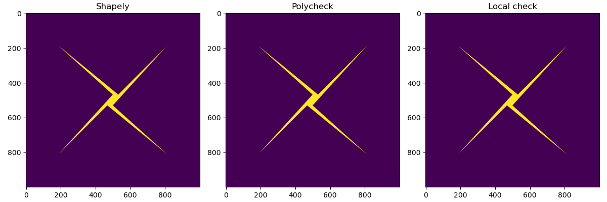

# polycheck

A short and sweet library to check whether a point is contained within an arbitrary polygon.  Created as an excuse to work with GPU/CUDA
code, and because Shapely is too slow...

## Results (preliminary)

Here's a snapshot of the current execution time for test of 1000x1000 points against a four-point polygon.  Three methods are tested:
* Shapely -- create a polygon and test each individual point
* Polycheck -- use the GPU to implement a parallel version of the Winding Number algorithm
  published by [Dan Sunday](https://en.wikipedia.org/wiki/Point_in_polygon).
* CPU -- same algorithm as Polycheck, but implemented in Python and run on the CPU without parallelization.

```
(dev) reggie$ python examples/polytest.py
Shapely total time: 6.861647129058838
Polycheck total time: 0.28629112243652344
Local check total time: 13.324239253997803```



## Prerequisites

* Cuda installed in /usr/local/cuda, tested against version 12.8
* Python 3.12 or greater
* warp-lang -- python wrapper of cuda libraries

## To build

```
pip install -e .
```

Test it with

```
python examples/polytest.py
```

